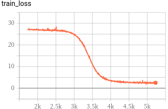

# Car parts classification (Learning)

## 環境構築
```bash
cd src
pip install -r requirements.txt
```

## datasetsフォルダの作成

```
datasets
├── label.txt            # クラス名を定義. 分類するクラスの名称を改行して書く. 
├── Images                # 画像データを保存するフォルダ. val用のデータはファイル名の先頭にvalと付ける. 
│   ├── hogehoge.jpg       # train用データ
│   ├── hogehoge2.jpg      # train用データ
│   ├── valhogehoge.jpg    # val用データ
│   └── valhogehoge2.jpg   # val用データ
├── BBoxes                # 正規化されたアノテーションデータ (label x y w h)
│   ├── hogehoge.txt       # ファイル名は画像データと同じファイル名で拡張子がtxt
│   ├── hogehoge2.txt
│   ├── valhogehoge.txt
│   └── valhogehoge2.txt
├── Labels                # 正規化されていないアノテーションデータ (xmin ymin xmax ymax label). BBoxesがある場合は不要.
│   ├── hogehoge.txt       # ファイル名は画像データと同じファイル名で拡張子がtxt
│   ├── hogehoge2.txt
│   ├── valhogehoge.txt
│   └── valhogehoge2.txt
├── Exclusion.txt          # 学習から除外する不適切画像を改行して書く. (ex. hogehoge.jpg)
└── Exclusion2.txt         # 学習から除外する不適切アノテーションを改行して書く. (ex. valhogehoge2.txt)　
    # Exclusion.txt, Exclusion2.txtのどちらかに格納されれば学習から除外される.
```

## 学習
 `config.yaml`を編集して学習の設定を行う

```bash
cd src
python src/train.py
```

`/result/20******_**_YOLONano/`以下に  
`checkpoints`, `tensorbaord`, `code` と `log.train.txt` が生成される。  
  - `checkpoints` : モデルのweight  
  - `tensorboard` : tensorbaordのlog  
  - `code` : 実行した時のコードやconfig  
  - `log.train.txt` : trainのlog  

## 評価 
```bash
cd src
python val.py ../results/20******_**_YOLONano
```
`result/20******_**_YOLONano/`に`log.val.txt`

## 結果
```
class           precision    recall        AP    count
------------  -----------  --------  --------  -------
headlight        0.567282  1         0.861028      215
backlight        0         0         0              44
wheel            0.720779  1.03256   0.996035      215
number-plate     0         0         0              19
mirror           0.528455  0.928571  0.796811      140
door             0.834783  0.936585  0.89189       205
front-panel      0.742647  0.855932  0.798398      118
rear-panel       0         0         0              13
front-bumper     0.722222  0.954128  0.860801      109
rear-bumper      0         0         0              13
all              0.411617  0.570778  0.520496     1091
```
<div align="center">

</div>

## 推論API
[best modelを使用したAPI]()

---
## 引用 
[YOLO Nano: a Highly Compact You Only Look Once
Convolutional Neural Network for Object Detection](https://arxiv.org/pdf/1910.01271.pdf) implemented in PyTorch.
